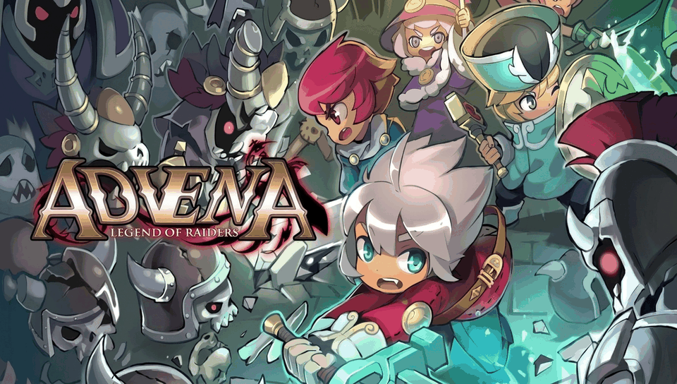

# Advena: Legend of Emeris — PS Vita Port

<p align="center">
  
</p>

This is a native PS Vita port of **Advena: Legend of Emeris (아드베나)**, the classic Action-RPG developed and published by **Gamevil**, running via an ARM dynamic library loader (soloader) and FalsoJNI.

---

## Features

- **Native Execution**: Runs the original ARMv6 Android shared library (`libgameDSO.so`) natively on the PS Vita's ARM Cortex-A9 CPU.
- **Hardware-Accelerated Rendering**: OpenGL ES 1.1 graphics powered by [vitaGL](https://github.com/Rinnegatamante/vitaGL) at 960x544.
- **Dual Control Scheme**: Full support for PS Vita physical buttons/analog sticks and front touchscreen.
- **Audio Subsystem**: Native multi-channel audio mixer supporting sound effects and background music streaming via Tremor / libvorbisidec.
- **Save Management**: Safe file I/O redirecting game save slots (`s0.dat`..`s2.dat`, `g.dat`) to `ux0:data/advena/saves/`.
- **Engine Bug Fixes**:
  - Fixed original engine Data Abort on save file loading (`CGsEncryptFile::ReadPtr`).
  - Fixed Teamstrike [T] button placement and forced all 5 combat action buttons visible.
  - Bypassed obsolete DRM/device ID checksum checks on save data.

---

## Controls

| PS Vita Button                    | In-Game Action                                     |
| --------------------------------- | -------------------------------------------------- |
| **D-Pad / Left Stick**            | Walk / Climb Ladder (Up, Down, Left, Right)        |
| **Cross (✕)**                     | Attack / Action / Talk to NPC / Confirm            |
| **Circle (◯)**                    | Jump Right (Forward Jump in combat)                |
| **Triangle (△)**                  | Jump Left (Backward Jump in combat)                |
| **Square (□) / Right Stick Left** | Skill Slot 1 / Submenu                             |
| **Right Stick Up**                | Skill Slot 2                                       |
| **Right Stick Down**              | Skill Slot 3                                       |
| **Right Stick Right**             | Skill Slot 4                                       |
| **L1 Trigger**                    | Teamstrike [T] / Quest [!] / Tab                   |
| **R1 Trigger**                    | Tag / Switch Character                             |
| **Select**                        | Inventory / Bag / Cancel / Back                    |
| **Start**                         | Pause Menu / System                                |
| **Touch Screen**                  | Direct UI interaction (dialogs, menus, navigation) |

---

## Installation

1. Install `kubridge.skprx` and `fd_fix.skprx` (or `rePatch`) on your PS Vita.
2. Install `libshacccg.suprx` (if not already installed).
3. Install `advena.vpk` on your PS Vita.
4. Obtain the original **Advena: Legend of Emeris (v1.0.1)** Android APK (`com.gamevil.advena.global`).
5. Extract the APK and copy the following files to `ux0:data/advena/`:
   - `lib/armeabi/libgameDSO.so` -> `ux0:data/advena/libgameDSO.so`
   - `assets/` -> `ux0:data/advena/assets/`
   - `res/` -> `ux0:data/advena/res/`
6. (Optional) Extract audio files into `ux0:data/advena/sound/` (`s000.ogg` to `s076.ogg`).

---

## Building from Source

### Prerequisites

- [VitaSDK](https://vitasdk.org/) installed and set in your environment (`$VITASDK`).
- `kubridge`, `vitaGL`, `vitashark`, `mathneon`, `vorbisidec` libraries installed in your VitaSDK sysroot.

### Compiling

```bash
export VITASDK=/path/to/vitasdk
export PATH="$VITASDK/bin:$PATH"

cmake -B build -S . -DCMAKE_TOOLCHAIN_FILE=$VITASDK/share/vita.toolchain.cmake -DCMAKE_POLICY_VERSION_MINIMUM=3.5
cmake --build build
```

This will produce:

- `build/advena.elf`
- `build/eboot.bin`
- `build/advena.vpk`

---

## Credits & Acknowledgements

- **Gamevil** for developing and publishing _Advena: Legend of Emeris_.
- **TheFloW** for the original .so loader concept.
- **Rinnegatamante** for [vitaGL](https://github.com/Rinnegatamante/vitaGL) and invaluable soloader contributions.
- **Volodymyr Atamanenko** for the soloader boilerplate and FalsoJNI framework.
